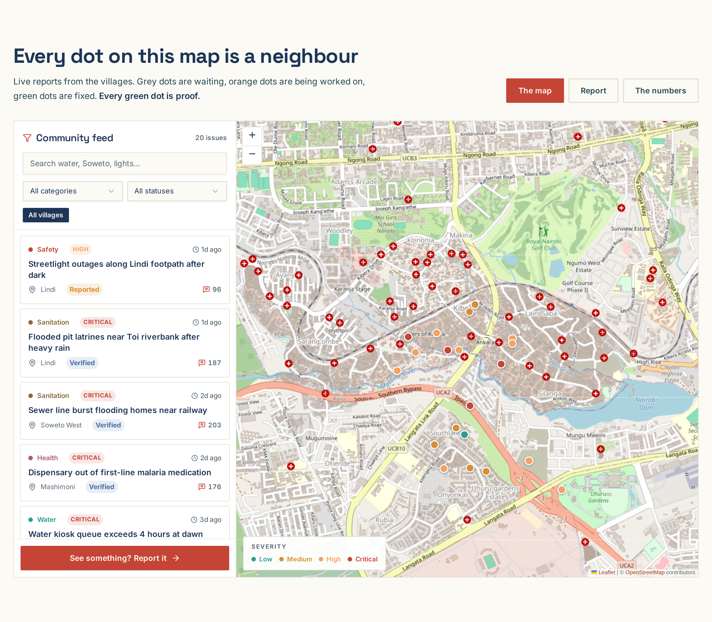
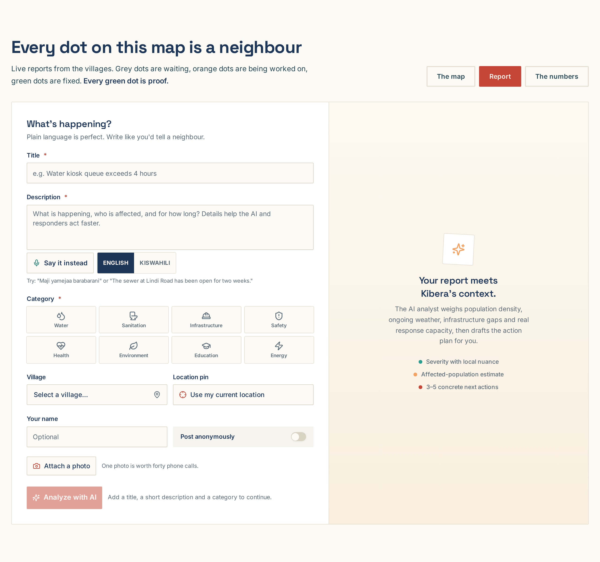
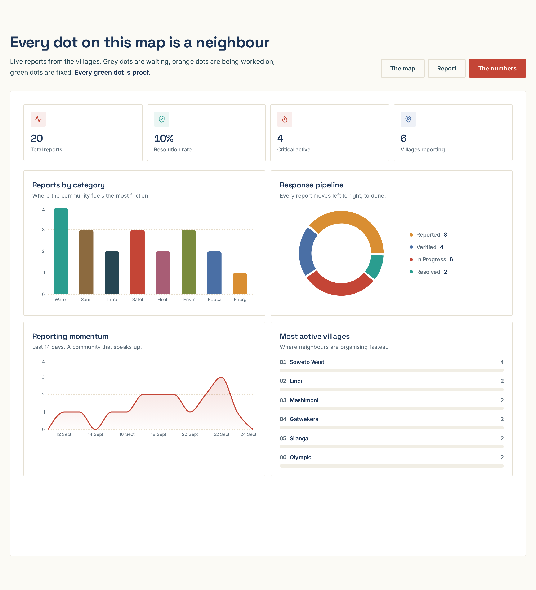
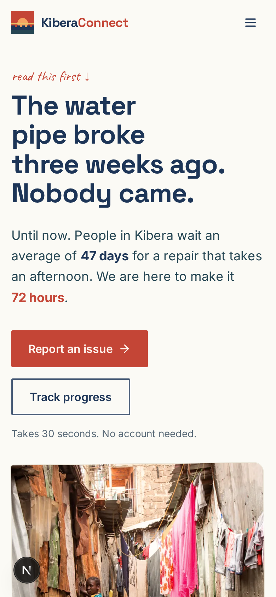

<div align="center">


# KiberaConnect

**Report it. Follow it. Get it fixed.**

[](https://kiberaconnect.netlify.app)
[](LICENSE)
[](https://nextjs.org)
[](https://www.typescriptlang.org)

A community proof engine for Kibera, Nairobi. See a broken pipe, a dead
streetlight, an open sewer. Take one photo. KiberaConnect finds everyone else
affected, makes noise on your behalf, and keeps the status public until
someone shows up and fixes it.

[Live site](https://kiberaconnect.netlify.app) · [Report an issue](https://kiberaconnect.netlify.app) · [Run it locally](#run-it-locally)

</div>

The water pipe broke three weeks ago. Nobody came. That is the problem this
project exists to end.



## The loop

1. **You see it. You snap it.** One photo, a few words in English, Kiswahili
   or Sheng. GPS tags itself. No account, 30 seconds. Do not feel like typing?
   Say it instead: the browser writes down what you tell it.
2. **We make noise.** Before you post, KiberaConnect checks whether a
   neighbour already reported the same thing within 60 meters. If they did,
   you are not the only one. Twenty neighbours reporting the same pipe is not
   twenty complaints, it is one work order the county cannot ignore.
3. **Someone shows up.** Triage scores severity with Kibera context, estimates
   who is affected, and drafts the action plan naming real desks: Nairobi
   Water, the CHV network, the village elder council, the area MCA office.
   The status stays public from the first photo to the last wrench.

## Why it is built on chama logic

Kenyans already trust one collective system completely: the chama. Twenty
people each putting in 500 shillings becomes a loan no single member could
raise alone. KiberaConnect runs the same math on problems.

| | Traditional chama | KiberaConnect |
|---|---|---|
| Unit of trust | 20 members | 20 neighbours |
| Small contribution | 500 KSh | 1 photo |
| Collective result | A 10,000 KSh loan | 1 unignorable work order |

Nobody is teaching a new behavior. We are giving a behavior people already
trust a place to live online.

## What is inside

- **Live map** with Leaflet + OpenStreetMap, severity markers, village
  filters and a community feed with photo evidence attached to reports
- **Report flow** with camera capture, voice reporting (Web Speech API, with
  an honest fallback to typing), anonymous posting and GPS pinning
- **Deterministic dedup**: reports within 60 meters that name the same
  specific problem cluster as one issue, and the flow tells you so before you
  post. Rule-based on purpose: it works on a low-end phone with two bars of
  network, it never fails mid-demo, and you can explain it to a village elder
  in one sentence
- **AI triage** that classifies the issue, scores severity with local nuance,
  estimates affected residents and proposes concrete next actions. When the
  model is unreachable, a keyword playbook tuned for English, Kiswahili and
  Sheng (maji, mtaro, choo, barabara, taa, takataka) triages anyway, so
  reporting never blocks
- **Insights dashboard**: category breakdown, response pipeline, 14-day
  momentum, village leaderboard
- **Dusty Morning design system**: red earth after rain, 6 AM sun through
  corrugated iron, Nairobi sky teal. Space Grotesk for display, Inter for
  body, Caveat for the pen notes. Sharp corners, honest borders, no
  glassmorphism

| Map | Report | Numbers |
|---|---|---|
|  |  |  |

Mobile first, because that is what Kibera reports from:



## Tech stack

| Layer | Choice |
|---|---|
| Frontend | Next.js 16 App Router, TypeScript, Tailwind CSS 4 |
| Database | Prisma + SQLite (seeded with 20 realistic reports across 11 villages) |
| AI | Chat completions SDK with a deterministic rulebook fallback |
| Maps | Leaflet + OpenStreetMap tiles |
| Voice | Web Speech API, no server round trip |
| Deploy | Netlify (`@netlify/plugin-nextjs`) |

## Run it locally

```bash
npm install
npx prisma generate && npx prisma db push
npx tsx scripts/seed.ts
npm run dev
```

Open http://localhost:3000. Copy `.env.example` to `.env` first if you want
to change the database path.

## Deploy to Netlify

The repo ships with `netlify.toml` and the official
`@netlify/plugin-nextjs` runtime.

1. Push this repo to GitHub.
2. In Netlify: **Add new site, Import an existing project**, pick the repo.
3. Deploy. The seed runs at build time, so the demo data is there on first
   load.

## The numbers this is built around

- 47 days: the average wait residents describe when infrastructure breaks and
  nothing tracks it
- 3 days: what the same problem looks like when twenty neighbours report
  together and the status stays public
- 20: the number of small voices that turn one photo into a work order

The seeded data mirrors real conditions: burst pipes in Gatwekera, flooded
pit latrines near the Toi riverbank, dead streetlights on the Lindi
footpath, a malaria medication stockout in Mashimoni. Sources and the full
research trail are in the app copy itself.

## Acknowledgments

- **Ushahidi** for pioneering community-driven mapping in Kenya
- **Map Kibera** for foundational geographic data and the idea that a map is
  a claim, not a decoration
- **AI Collective and Hack for Humanity: Nairobi** for the push to build for
  the place we live

## License

[MIT](LICENSE). Take it, fork it, run it in Mathare, in Mukuru, wherever
neighbours need proof on their side.
